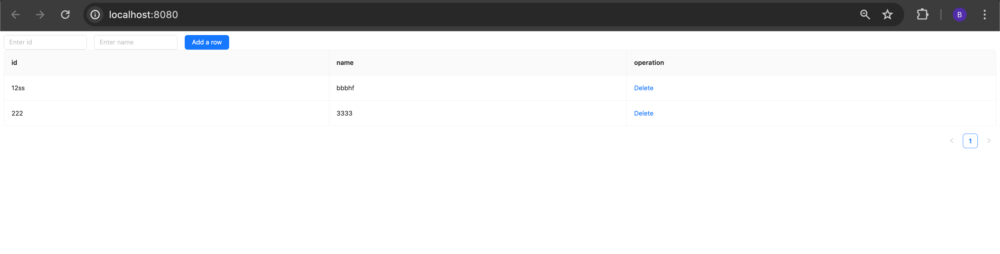

# react-typescript-starter

###### Minimalist React 18 starter template with TypeScript ⚛ without usage of create-react-app.

Configured with:

-   Webpack
-   ESLint
-   Prettier

## Description

This is a simple To-Do List app, built with React and TypeScript. It allows users to read, create, and update a list of duties.

## Project Setup

To get the project up and running, follow these steps:

1. Clone the repository:

bash
git clone https://github.com/billy7038862/starter.git

2. Navigate into the project directory:

bash
cd my-app

3. Install the dependencies:

bash
npm install

## Running the App

To start the server and launch the app, run:

bash
npm start

The app should now be running on [http://localhost:8080](http://localhost:8080).

## Usage

On the frontend, you will see a list of to-do items (if any) fetched from the backend.

You can add new to-do items using the form at the top of the page.

You can edit item by clicking the field and change its value and press enter.

## Screenshots

Todo list

